# Klasifikasi Sentimen Review Steam — Resident Evil 9 Requiem (BERT)

Proyek klasifikasi sentimen (positif/negatif) terhadap review game **Resident Evil Requiem** di Steam, menggunakan model **BERT (bert-base-uncased)** dari HuggingFace Transformers.

| Info | Detail |
|---|---|
| Game | Resident Evil Requiem (Steam App ID: 3764200) |
| Model | `bert-base-uncased` |
| Tujuan | Klasifikasi sentimen review: Positif / Negatif |
| Strategi Data | Balanced 50% Positif : 50% Negatif |

## Dataset

- Sumber: Steam API (`/appreviews/{app_id}`) untuk game **Resident Evil Requiem** (App ID: 3764200)
- Total: 2000 review (1000 positif, 1000 negatif) → 1997 setelah dibersihkan (3 duplikat dihapus)
- Kolom: `review`, `label` (1=Positif, 0=Negatif), `game`

## Alur Proses & Penjelasan

### 1. Instalasi & Import Library

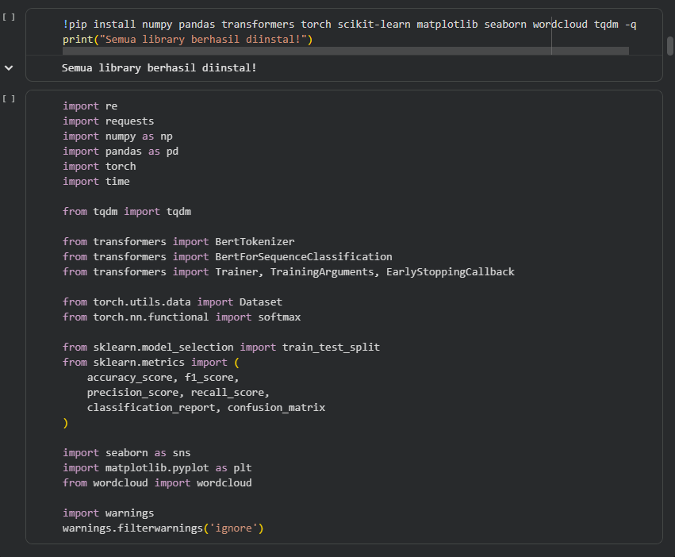

Library yang digunakan: `numpy` & `pandas` untuk manipulasi data, `transformers` (`BertTokenizer`, `BertForSequenceClassification`, `Trainer`, `TrainingArguments`, `EarlyStoppingCallback`) untuk pemodelan BERT, `torch` untuk operasi tensor, `scikit-learn` untuk pembagian data & metrik evaluasi, serta `matplotlib`, `seaborn`, dan `wordcloud` untuk visualisasi.

### 2. Pengumpulan Data (Scraping)

Data ulasan dikumpulkan langsung dari Steam Web API menggunakan fungsi kustom `scrape_review_balanced()` dengan mekanisme *cursor-based pagination*, difilter berdasarkan bahasa (Inggris) dan jenis rekomendasi (positive/negative) agar komposisi kelas seimbang sejak awal — bukan disamakan belakangan.

Contoh data hasil scraping:

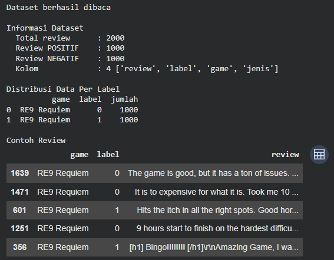

### 3. Eksplorasi Data (EDA)

Distribusi kelas positif dan negatif relatif seimbang (±1000 masing-masing), sehingga dataset layak dipakai tanpa perlu teknik penyeimbangan tambahan.

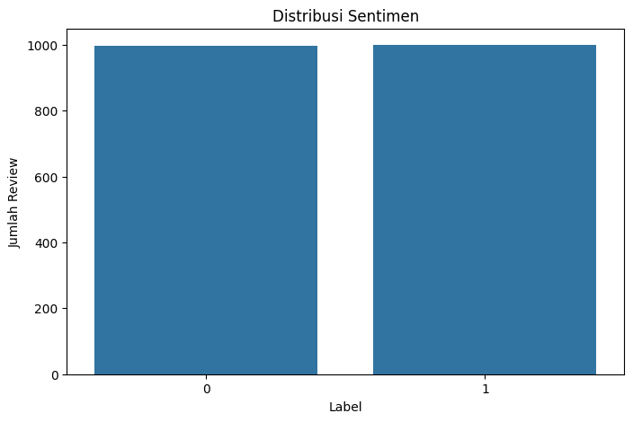

WordCloud kata yang paling sering muncul:

| Seluruh Ulasan | Ulasan Positif | Ulasan Negatif |
|---|---|---|
| 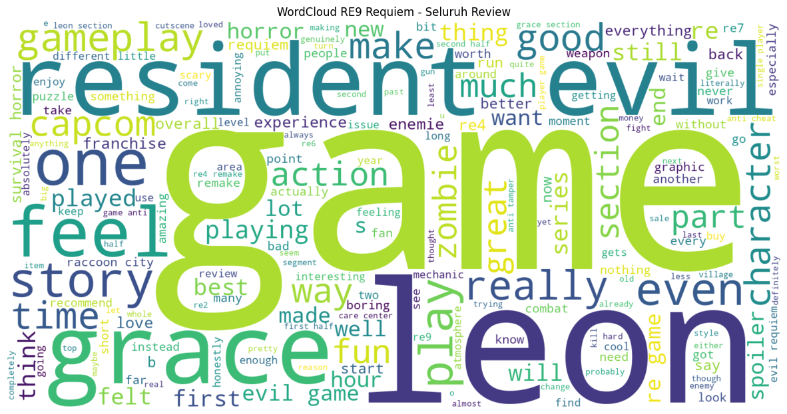 | 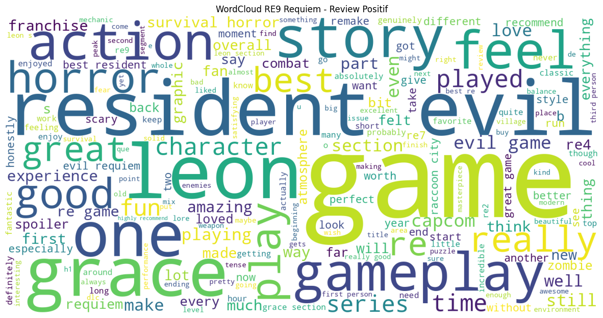 | 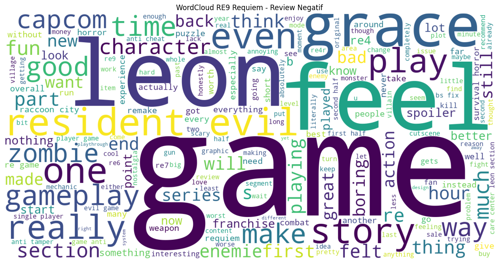 |

Kata dominan di seluruh ulasan: *game, leon, resident, story, gameplay, character, good*. Pada ulasan positif menonjol kata seperti *great, best, good, well, fun*; pada ulasan negatif menonjol *bad, spoiler, boring, issue, problem*.

### 4. Preprocessing Teks

Teks dibersihkan: hapus URL, tag HTML, karakter non-ASCII/emoji, normalisasi huruf berulang (`soooo` → `soo`), lowercase, dan hapus duplikat (3 baris duplikat dihapus → dataset akhir 1997 ulasan).

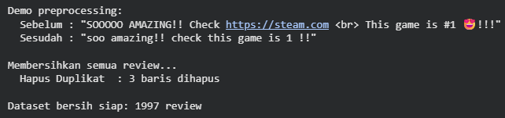

Contoh: `"SOOOOO AMAZING!! Check https://steam.com <br> This game is #1 😍!!!"` → `"soo amazing!! check this game is 1 !!"`

### 5. Tokenisasi BERT

Teks bersih ditokenisasi dengan `BertTokenizer` (`bert-base-uncased`), ditambah token `[CLS]` di awal dan `[SEP]` di akhir, dengan `max_length=128`, `padding='max_length'`, `truncation=True`.

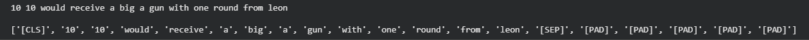

### 6. Pembagian Dataset

Split 70:15:15 (Train:Validation:Test) menggunakan `train_test_split` dengan `stratify=y` agar proporsi label tetap seimbang di tiap subset.

| Subset | Jumlah | Proporsi | Positif | Negatif |
|---|---|---|---|---|
| Training | 1.442 | ≈72,2% | 722 | 720 |
| Validation | 255 | ≈12,8% | 128 | 127 |
| Test | 300 | ≈15,0% | 150 | 150 |

### 7. Load Model & Fine-Tuning

Model `BertForSequenceClassification` dimuat dari checkpoint `bert-base-uncased`. Parameter `classifier.weight`/`classifier.bias` berstatus MISSING — ini normal karena lapisan klasifikasi diinisialisasi baru dan dipelajari saat fine-tuning.

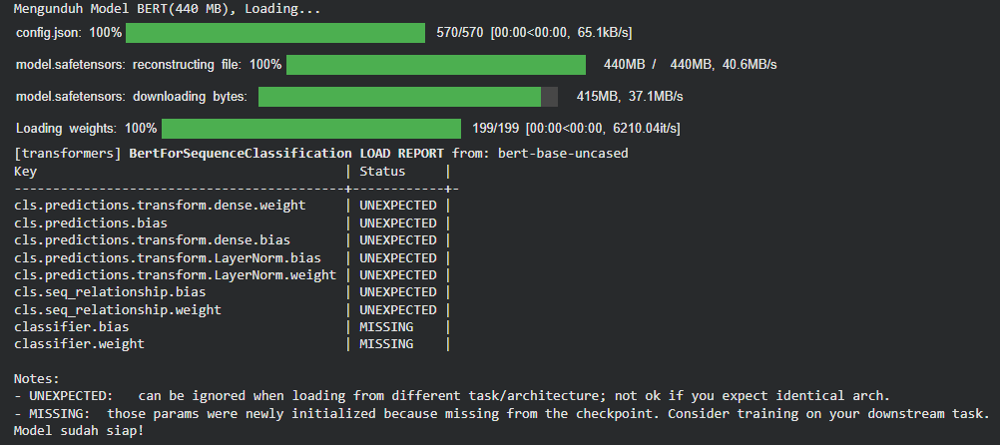

**Konfigurasi training:** 3 epoch, batch size 16, learning rate 2e-5, optimizer AdamW, evaluasi & simpan model tiap akhir epoch, model terbaik dipilih berdasarkan F1-score tertinggi, dengan `EarlyStoppingCallback` (patience 2 epoch).

| Epoch | Training Loss | Validation Loss | Accuracy | F1-Score |
|---|---|---|---|---|
| 1 | 0,3636 | 0,3560 | 0,8392 | 0,8383 |
| 2 | 0,2461 | 0,3512 | 0,8549 | 0,8541 |
| 3 | 0,1082 | 0,3593 | 0,8862 | 0,8862 |

F1-score terus meningkat tiap epoch (early stopping tidak aktif), total waktu training ±110 menit.

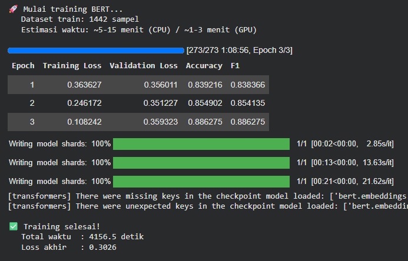

### 8. Evaluasi Model

Dievaluasi pada 300 data test yang belum pernah dilihat model:

| Metrik | Nilai |
|---|---|
| Accuracy | 92,67% |
| Precision | 92,74% |
| Recall | 92,67% |
| F1-Score | 92,66% |

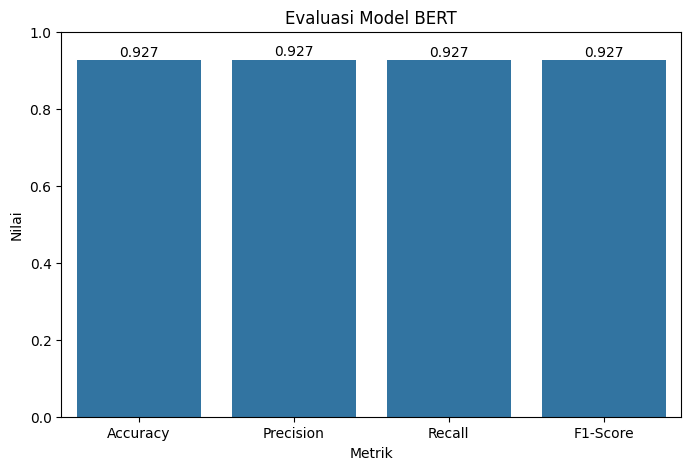

**Confusion Matrix** (n=300): 136 negatif & 142 positif diprediksi benar; 14 negatif salah diprediksi positif (False Positive), 8 positif salah diprediksi negatif (False Negative).

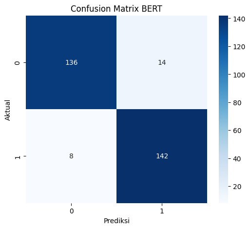

|  | Prediksi Negatif | Prediksi Positif |
|---|---|---|
| **Aktual Negatif** | 136 (TN) | 14 (FP) |
| **Aktual Positif** | 8 (FN) | 142 (TP) |

### 9. Deployment / Uji Coba

Model diuji dengan kalimat baru di luar dataset:

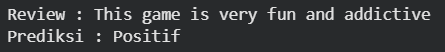

Hasil prediksi juga disusun dalam dataframe lengkap (Review, Label Asli, Prediksi, probabilitas kelas positif) untuk analisis lebih lanjut:

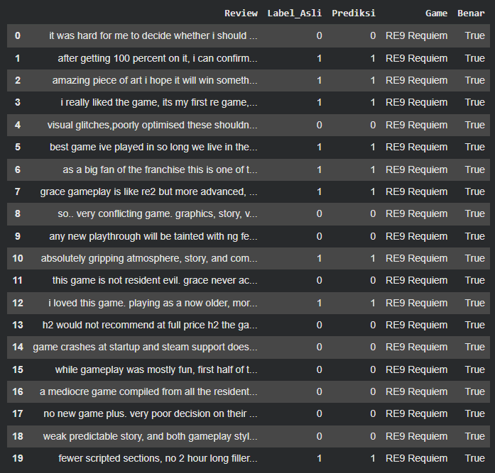

**Analisis tambahan — rata-rata panjang ulasan per sentimen:** ulasan negatif jauh lebih panjang (182,0 kata) dibanding ulasan positif (80,6 kata), mengindikasikan pengguna dengan sentimen negatif cenderung menulis kritik lebih detail.

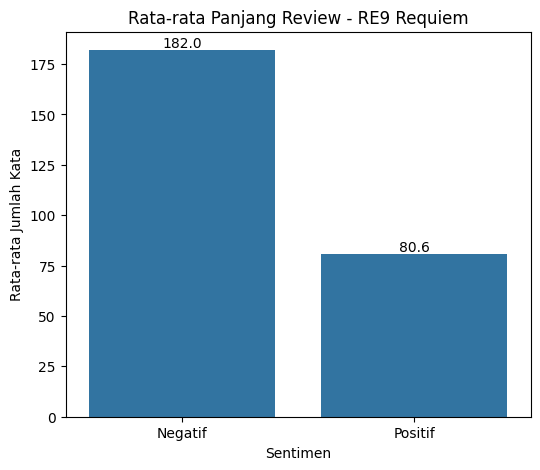

**Kata yang paling sering muncul per sentimen** (setelah stopwords disaring): ulasan positif didominasi istilah naratif/karakter (mis. Leon, story), ulasan negatif didominasi istilah teknis (bug, crash, optimisasi).

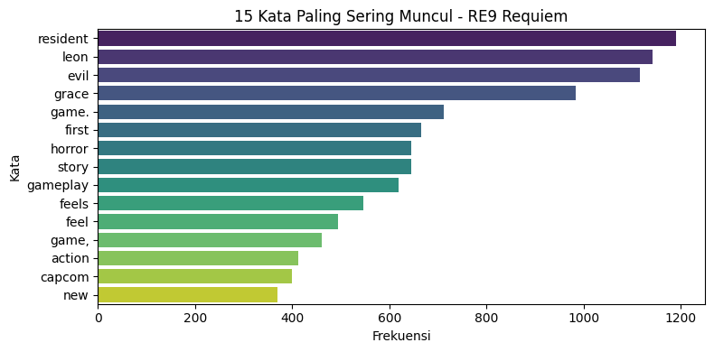

## Kesimpulan

Model BERT hasil fine-tuning mencapai **akurasi 92,67%** dalam mengklasifikasikan sentimen review Steam, dengan performa seimbang antara precision dan recall. Model konsisten mengenali sentimen baik pada ulasan pendek maupun panjang, dan berhasil menangkap konteks bahasa gaul/informal khas review game.

## Struktur Repo

```
.
├── klasifikasi_sentimen_re9_bert.ipynb   # Notebook utama
├── requirements.txt                       # Dependencies
├── images/                                # Gambar dokumentasi (dari laporan)
└── README.md
```

> Catatan: dataset (`data_mentah_steam.csv`) di-generate lewat proses scraping di dalam notebook (sel "Konfigurasi Game & Target Scraping"). Jalankan sel scraping terlebih dahulu, atau siapkan CSV dengan kolom `review`, `label`, `game` sebelum menjalankan sel preprocessing.

## Instalasi

```bash
pip install -r requirements.txt
```

## Cara Menjalankan

1. Buka `klasifikasi_sentimen_re9_bert.ipynb` di Jupyter Notebook / Google Colab
2. Jalankan sel secara berurutan dari atas ke bawah
3. Model akan mengunduh `bert-base-uncased` (~440MB) otomatis saat pertama kali dijalankan

## Author

Muhammad Rafi Fadillah
